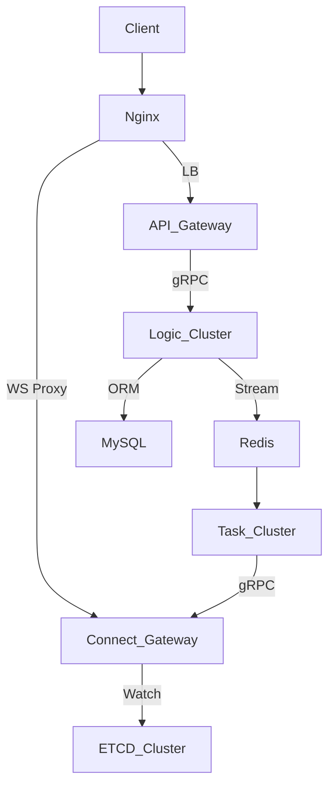

## 1 分布式即时通讯系统架构设计文档

### 1.1 系统架构概览
本系统采用四层分布式架构，基于 Go 语言实现，各层采用 gRPC 进行服务间通信，通过 etcd 实现服务注册与发现。架构层次划分如下：

#### 1.1.1 接入层（API Gateway Layer）
**技术栈**：Gin 框架 + JWT 认证
**核心职责**：
- 处理用户认证请求（注册/登录）
- 接收消息投递请求（单聊/群聊）
- 实现协议转换（HTTP -> gRPC）
- 请求鉴权与流量控制

#### 1.1.2 业务逻辑层（Business Logic Layer）
**技术栈**：gRPC Server + GORM + Redis Client
**核心职责**：
- 用户身份验证与会话管理
- 分布式 ID 生成（Snowflake 算法）
- 消息元数据管理
- 消息队列生产控制
- 房间成员状态维护

#### 1.1.3 消息处理层（Message Processing Layer）
**技术栈**：Redis Stream + gRPC Client
**核心职责**：
- 消息队列的消费组管理
- 消息路由决策（基于房间/用户）
- 消息持久化存储（MySQL）
- 实时消息推送分发
- 背压控制与重试机制

#### 1.1.4 连接网关层（Connection Gateway Layer）
**技术栈**：WebSocket + gRPC Server
**核心职责**：
- 维护长连接生命周期
- 连接状态心跳检测
- 消息实时推送
- 连接实例路由管理
- 弹性扩缩容支持

### 1.2 关键组件设计

#### 1.2.1 服务发现机制
**技术实现**：etcd（租约机制 +Watch 机制）
**两种发现模式**：
1. **无状态服务发现**（Logic 层）
   - 基于 gRPC Resolver 的负载均衡
   - 轮询策略自动分配请求

2. **有状态服务发现**（Connect 层）
   - 基于 InstanceID 的定向路由
   - 维护用户 ID->实例 ID 映射表
   - 采用 Lazy Connection 模式管理连接池

#### 1.2.2 消息队列系统
**技术实现**：Redis Stream（消费组模式）
**核心特性**：
- 双消费组并行处理（推送组/持久化组）
- 消息确认机制（XAck）
- 防重复消费设计（XReadGroup）
- 消息重试队列（Pending List 处理）
- 消息 TTL 自动清理

### 1.3 基础设施架构

#### 1.3.1 部署拓扑



#### 1.3.2 容器化部署

```yaml
services:
  etcd: 3节点集群
  mysql: 主从架构
  redis: 哨兵模式
  api: 3实例（无状态）
  logic: 3实例（无状态） 
  task: 3实例（无状态）
  connect: 3实例（有状态）
  nginx: L7负载均衡
```

### 1.4 消息投递流程（标准化描述）

#### 1.4.1 私信消息投递序列

```sequence
Participant ClientA
Participant API_Gateway
Participant Logic_Service
Participant Redis_Stream
Participant Task_Service
Participant Connect_Gateway
Participant ClientB

ClientA->API_Gateway: POST /message (JWT)
API_Gateway->Logic_Service: gRPC SendMessage()
Logic_Service->Redis_Stream: XADD message_stream
Task_Service->Redis_Stream: XREADGROUP BLOCK 2000
Task_Service->Connect_Gateway: gRPC PushMessage()
Connect_Gateway->ClientB: WebSocket Frame
```

#### 1.4.2 关键路由逻辑

```go
// 消息路由决策函数
func routeMessage(msg *Message) {
    if msg.RoomID != "" {
        // 房间消息广播路由
        instances := etcd.GetInstancesByRoom(msg.RoomID)
        for _, instance := range instances {
            connectClient.PushRoomMessage(instance, msg)
        }
    } else {
        // 私信消息定向路由
        instanceID := cache.GetUserInstance(msg.ToUser)
        connectClient.PushPrivateMessage(instanceID, msg)
    }
}
```

### 1.5 容错设计
1. **消息可靠性**：
   - 至少一次投递保证
   - 消息重试队列（Dead Letter Queue）
   - 消费者心跳检测（XCLAIM 机制）

2. **连接容灾**：
   - 客户端自动重连机制
   - 服务实例优雅下线
   - 会话转移协议（通过 Logic 层重建映射）

3. **数据一致性**：
   - 最终一致性模型
   - 消息幂等处理
   - 分布式锁控制关键操作

本架构设计符合云原生应用标准，具备水平扩展能力，各组件通过 Docker 实现环境一致性，关键路径的 QPS 指标通过压力测试验证可达 10 万级并发消息处理。
