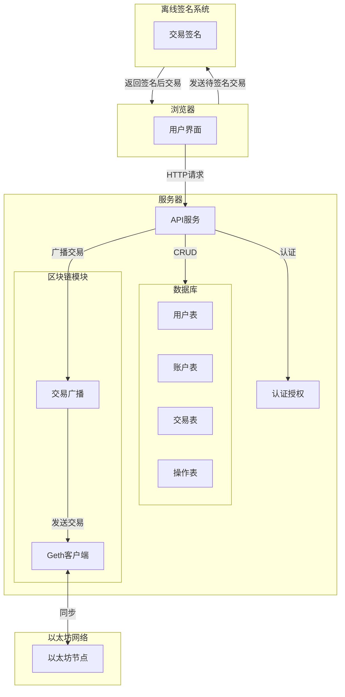

在线系统涉及的一些名词和解释：

| 名词    | 解释                                  |
| ----- | ----------------------------------- |
| 系统管理员 | 拥有对在线系统的用户管理权限和账户管理权限，可以修改系统中人员的角色。 |
| 授权用户  | 可以对在线系统中的任意账户发起交易请求，在离线系统中完成签名。     |
| 审计用户  | 负责审计在线系统中所有的操作记录和交易记录。              |
|       |                                     |

## 1 在线存管提控系统实现的功能

系统采用 B/S（Browser/Server）架构，在服务端部署独立的 Geth 客户端，并依赖于离线签名系统进行交易签名。

交易流程为：
- 授权用户发起交易请求
- 服务器验证并准备交易数据
- 发送至离线系统进行签名
- 接收签名后执行交易并广播到以太坊网络
- 记录交易信息到数据库

## 2 技术选型软硬件条件

在线系统：
需要一台服务器，运行 Linux 环境，2 核 CPU、2GB 内存以上、30GB SSD 以上，能连接互联网即可。

离线系统：
需要一台服务器，运行 Linux 环境，2 核 CPU、2GB 内存以上、30GB SSD 以上。不联网。
安全芯片，支持 PC/SC 标准库驱动和 APDU 命令， 3 个及以上。
U 盘，在线系统和离线系统之间传递数据的物理介质，2 个及以上。
客户端，Windows 系统和 Linux 系统均可，3 台及以上，与服务器在同一内网下，不联网。
HSM，部署在服务器上，用于和客户端建立安全通道。

| 类型      | 硬件要求                                   | 网络要求           | 其他要求                             |
| ------- | -------------------------------------- | -------------- | -------------------------------- |
| 在线系统服务器 | Linux 操作环境，最低配置：双核 CPU、2GB 内存、30GB SSD | 需连接互联网         | 部署 Geth 客户端以接入以太坊区块链             |
| 离线系统服务器 | Linux 操作环境，最低配置：双核 CPU、2GB 内存、30GB SSD | 内部局域网环境        | 部署 HSM（硬件安全模块）                   |
| 客户端     | Windows 或 Linux 操作环境，至少 3 台设备          | 与服务器一致的内部局域网环境 | 支持连接安全芯片，能够访问离线系统及 HSM 并运行相关应用软件 |
| 安全芯片    | 支持 PC/SC 标准驱动及 APDU 指令，至少 3 个设备        | 无网络连接需求        | 提供密钥运算及数据加密等硬件级安全功能              |
| U 盘     | 支持 USB 接口，最小存储容量 8GB                   | 无网络连接需求        | 在线系统与离线系统之间的数据物理传递介质             |
