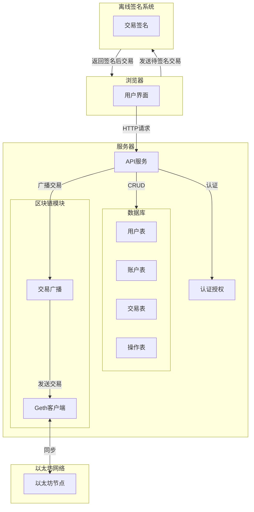

在线系统涉及的一些名词和解释：

| 名词    | 解释                                  |
| ----- | ----------------------------------- |
| 系统管理员 | 拥有对在线系统的用户管理权限和账户管理权限，可以修改系统中人员的角色。 |
| 授权用户  | 可以对在线系统中的任意账户发起交易请求，在离线系统中完成签名。     |
| 审计用户  | 负责审计在线系统中所有的操作记录和交易记录。              |

## 1 在线存管提控系统实现的功能

系统采用 B/S（Browser/Server）架构，在服务端部署独立的 Geth 客户端，并依赖于离线签名系统进行交易签名。

交易流程为：
- 授权用户发起交易请求
- 服务器验证并准备交易数据
- 发送至离线系统进行签名
- 接收签名后执行交易并广播到以太坊网络
- 记录交易信息到数据库

## 2 已有的开发成果

在线系统实现了核心的交易操作逻辑，可以将用户输入的交易数据打包成一个哈希值并发送到离线系统签名，待签名完成后执行上链交易。

离线系统实现了门限签名算法的核心逻辑，已经实现了基于命令行的使用。密钥生成会得到三个私钥分片，并且可以使用门限值的私钥分片完成签名。

完成了客户端的原型开发，能成功连接安全芯片进行通信交互。
## 3 技术选型软硬件条件

| 类型      | 硬件要求                                   | 网络要求           | 其他要求                             |
| ------- | -------------------------------------- | -------------- | -------------------------------- |
| 在线系统服务器 | Linux 操作环境，最低配置：双核 CPU、2GB 内存、30GB SSD | 需连接互联网         | 部署 Geth 客户端以接入以太坊区块链             |
| 离线系统服务器 | Linux 操作环境，最低配置：双核 CPU、2GB 内存、30GB SSD | 内部局域网环境        | 部署 HSM（硬件安全模块）                   |
| 客户端     | Windows 或 Linux 操作环境，至少 3 台设备          | 与服务器一致的内部局域网环境 | 支持连接安全芯片，能够访问离线系统及 HSM 并运行相关应用软件 |
| 安全芯片    | 支持 PC/SC 标准驱动及 APDU 指令，至少 3 个设备        | 无网络连接需求        | 提供密钥运算及数据加密等硬件级安全功能              |
| U 盘     | 支持 USB 接口，最小存储容量 8GB                   | 无网络连接需求        | 在线系统与离线系统之间的数据传递介质               |
## 4 项目难点

本项目以在线/离线系统分离架构为基础，采用门限签名算法和基于安全芯片与 HSM 的通信安全协议，工作量大、技术难点高，突出安全性与创新性。
### 4.1 系统架构设计
- 在线系统与离线系统的分离设计，创新性地将私钥管理完全隔离在离线系统中，避免与外部网络直接交互，从而确保私钥的物理安全和逻辑安全。
- 实现在线/离线系统的高效协作需解决数据隔离、传输和一致性问题，同时需适配多种硬件设备，确保生态系统稳定性和兼容性。
### 4.2 门限签名算法
- 门限签名算法创新性地将密钥分片管理，与 Shamir 秘密共享等技术相结合，实现私钥的分布式存储与签名过程分散化，避免了私钥的集中存储风险。
- 算法实现涉及分布式计算、分片生成与重组的高效实现，需保证安全性与性能的平衡。同时，算法需与离线系统深度集成，对计算资源和节点协作提出了高要求。
### 4.3 通信协议开发
- 设计了基于安全芯片和 HSM 的通信协议。协议通过安全芯片存储的数字证书与 HSM 的非对称加密握手生成不可预测的会话密钥，后续通信基于会话密钥加密。
- 需自主设计一套客户端与服务器之间的高效加密密钥交换协议，并确保协议的无漏洞实现。与硬件设备协同，加大了开发的难度。
### 4.4 硬件安全特性
- 离线系统结合了门限签名算法与硬件级安全设备，私钥分片分别存储在多个安全芯片中，安全芯片提供不可篡改性和物理防护，HSM 提供高性能硬件加密支持，实现了密钥生成、分片管理及签名的全流程硬件级加密。
- 实现安全芯片与 HSM 的硬件适配，以及多硬件设备协同工作需进行底层驱动开发与优化。