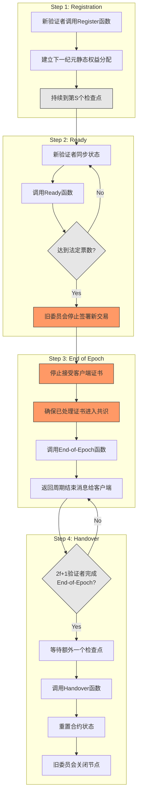

## abstract

Sui Lutris 是首个实现 **亚秒级最终确认** 的智能合约平台，通过创新性地结合 **无共识协议** 和**高吞吐量共识协议**，在确保安全性的同时显著降低延迟。无共识协议负责快速确认大多数交易，而共识协议仅在存在并发冲突时才介入，解析全局顺序，从而兼顾 **表达能力** 和 **吞吐量**。

为解决 **重新配置事件** 带来的复杂性，Sui Lutris 提出了首个 **形式化证明安全且高效的重新配置协议**，确保系统在不中断运行的情况下维持安全性和活跃性。平台设计以 **对象（Objects）** 而非账户为核心资源，支持灵活的智能合约执行。

实验结果表明，Sui Lutris 在每秒处理 5,000 个证书（相当于 15 万个交易操作）时，延迟低于 0.5 秒，远优于当前 3 秒的先进共识协议，并能平稳应对验证者崩溃及重新配置过程，无显著性能下降。目前，Sui Lutris 已投入生产，为 Sui 智能合约平台提供支持。

>   **无共识协议**（Consensusless Agreement）：核心思想是通过**一致性广播**来处理单一用户控制的对象的事务，而无需依赖传统的共识协议。 
>
>   **高吞吐量共识协议**：Sui Lutris 使用了高吞吐量的拜占庭容错（BFT）共识协议，具体采用了**Narwhal-Bullshark 共识协议**，主要用于共享对象（shared objects）或需要全局一致性的事务。
>
>   重新配置事件：Reconfiguration Events，指的是系统在运行期间对其**验证者、节点、网络拓扑或配置**进行动态更改的过程。

## Introduction

传统区块链通过 **全序排序（Total Ordering）** 和共识机制防止“双花”攻击。然而，近年来提出的基于 **一致性广播** 和 **可靠广播** 的“无共识系统”（Consensusless Systems）为去中心化支付提供了轻量化替代方案。这些系统通过**单一授权路径**控制**对象**（如代币）来保障交易活跃性，但它们尚未被广泛应用，原因包括：

1.   **功能限制**：无共识协议通常仅支持资产转移，缺乏通用性。

2.   **动态环境挑战**：难以支持状态检查点和验证者重新配置。

3.   **错误敏感性**：客户端错误（如双重签名）可能导致资产锁定。

**Sui Lutris** 是首个结合无共识与共识方法的系统，在拜占庭容错环境中实现了两者的优势。它通过一致性广播协议降低延迟，并在以下情况下使用共识机制：处理复杂共享所有权对象的智能合约，以及定义检查点和执行网络维护操作。由无许可验证者维护，Sui Lutris 兼顾了灵活性与高效性，适合生产环境应用。

>   一致性广播（Consistent Broadcast）：一致性广播确保消息在分布式系统中的多个参与者之间以一致的方式传播。它的核心目标是**一致性**：
>
>   -   如果一个节点接收了一条消息，则所有正确的节点最终都会接收到该消息。
>   -   所有节点接收到的消息顺序是一致的。
>
>   可靠广播（Reliable Broadcast）：用于确保在拜占庭容错环境下，消息能够在恶意节点存在的情况下正确传播。可靠广播除了保证一致性外还要求：
>
>   -   消息不会丢失和被篡改。
>
>   单一授权路径：在基于一致性广播和可靠广播的系统中，**对象的控制权**通过“单一授权路径”来实现，而不是依赖于全局共识。这种设计的核心思想是：**每个对象（例如一枚代币或一个资产）都有一个明确的控制者，负责对该对象的操作进行授权**。
>
>   状态检查点（State Checkpoints）：是分布式系统中的一种机制，用于记录系统当前状态的“快照”。类似于存档点，包含了系统在某个时间点的完整状态信息，包括账户余额、智能合约状态、交易历史等。

**Sui Lutris** 克服了三大关键挑战，实现了高效、可靠的区块链运行：

1.   **检查点协议**：通过 **事后检查点协议** 归档历史记录，生成按区块排列的规范交易序列，减少内存占用与启动成本，同时确保低延迟和即时确认。

2. **客户端错误容忍**：传统无共识协议在低延迟的同时可能降低可用性，例如配置错误的客户端可能导致账户死锁。 Sui Lutris 限制客户端错误的影响范围，仅影响单纪元内的双重签名对象活跃性，并通过实验验证性能在短纪元（10 分钟）下仍保持稳定。

3.   **动态参与与重新配置**：设计了 **定制的重新配置协议**，解决验证者动态参与与错误配置的潜在风险，确保交易不回滚，并保持系统活跃性和安全性。

>   账户死锁：如果客户端在发起交易时低估了所需的 Gas 费用，交易可能会因为费用不足而被拒绝或无法执行，账户的状态可能会被锁定。
>
>   纪元机制（Epoch Mechanism）：是分布式系统中常用的时间或状态分片方法。系统运行被划分为多个时间段（纪元），每个纪元内参数、状态或参与者（如验证者）固定，纪元切换时可重新配置或重置状态。

**Sui Lutris** 是 Sui 区块链的核心系统，自 2023 年 5 月上线以来无停机运行，支持 107 个验证节点，每日处理超过 **310 万证书**，并经历 **383 次 epoch 变更**。2023 年 7 月创下单日处理 **6500 万证书** 的区块链最高记录。

Sui Lutris 通过无共识路径实现低延迟，在 10 个节点下实现 **0.5 秒最终性**，支持 **15 万 ops/s** 的高吞吐量，即使 1/3 验证节点崩溃，性能仍保持稳定。相比主流协议 Bullshark，最终性速度快 **15 倍**，并支持高效并行执行，展现了卓越的现实世界性能。

>   证书：是 Sui Lutris 中验证交易合法性和最终性的核心数据结构，包含交易信息及验证者签名。与传统区块链直接排序写入交易不同，证书通过 Fast Path 和 Consensus Path 优化交易处理，支持并行执行和复杂操作，显著提高吞吐量和降低延迟，是交易的验证与确认结果的封装。

本文的贡献包括以下四点：

1.	**提出 Sui Lutris 系统**：首次设计并实现了智能合约平台，在单写入者操作中完全无需共识，仅在多写入者操作时依赖共识，安全高效地结合了两种处理模式，显著降低延迟。

2.	**高效检查点机制**：创新性地使用共识引擎为无共识区块链创建检查点，实现交易执行后再排序的机制，既保留了无共识路径的低延迟优势，又减少了一致性需求。

3.	**安全重配置机制**：设计了全新的重配置协议，允许系统以最小停机时间完成验证者的动态调整，支持宽容的双花行为，帮助用户在误操作或配置错误后恢复资产访问权限。

4.	**生产级实现与评估**：完成 Sui Lutris 的生产级实现，并通过在真实地理分布的验证者节点环境中进行严格测试，验证了其在多种交易负载和故障条件下的高性能与可靠性。

## Background & Models

Sui Lutris 采用了一种新颖的区块链交易处理方法，通过在关键延迟路径中省略共识的需求来确保低延迟。然而，跳过共识仅能为**单一所有者资产**（即不可变资产或由单一地址直接或间接拥有的资产）提供**最终性**（确认交易将被执行）和**结算性**（确认交易的具体执行结果）。

尽管单一所有者交易构成了主网负载的大部分，但这些类型的资产并不足以表达所有类型的智能合约功能，因为某些交易必须处理属于不同方的资产。对于这些需要处理多个参与方资产的交易，我们只能获得**最终性**，但必须推迟**结算性**，直到潜在的冲突被解决。因此，Sui Lutris 结合了一个共识协议来处理这些情况。

>   **最终性**（Finality）：指交易被确认且不可撤销的属性，即系统保证该交易不会被回滚或替代，但具体的执行结果可能尚未完全确定。通常在 2 RTT 内完成。
>
>   -   对于**单一所有者资产**的交易，最终性在交易被验证者签署并形成交易证书（Transaction Certificate）后立即达成。这时，交易已经被锁定，其他冲突交易无法再提交。
>   -   对于涉及**共享资产**的交易，最终性需要通过共识协议来实现，即交易必须被共识引擎排序后才能达成最终性。
>
>   **结算性**（Settlement）：指交易的具体执行结果已经确定，并且这些结果已经在区块链状态中生效，可以被后续交易依赖或使用。即交易的影响已被全网验证者接受并持久化。
>
>   -   对于**单一所有者资产**的交易，结算性与最终性几乎同时达成，因为这些交易可以直接执行，不需要共识协议来排序。
>   -   对于涉及**共享资产**的交易，结算性需要等待共识协议完成排序，并且交易的具体执行结果被验证者确认后才能达成。

接下来，我们定义了 Sui Lutris 需要解决的问题、威胁模型以及它所维护的安全属性。

### **威胁模型（Threat Model）**

我们假设一个消息传递系统，其中每个纪元包含一组 n 个验证器，并且系统面临一个计算受限的对手（adversary）。该对手能够控制网络，并且在任意纪元内可以静态破坏至多 f < n/3 的验证器。被对手破坏的验证器被称为拜占庭节点（Byzantine）或故障节点（faulty），而其余的验证器被称为诚实节点（honest）或正确节点（correct）。

为了模拟真实网络，我们假设诚实验证器之间存在异步的、最终可靠的通信链接。这意味着消息延迟没有上限，并且在有限但未知的范围内可能会有消息丢失。

#### 共识协议（Consensus Protocol）

Sui Lutris 使用共识协议作为一个黑盒，它接受一些有效输入并输出一个全序（total ordering）。该协议不引入额外的同步假设，因此继承了底层共识协议的同步假设。在我们的实现中，具体采用了 Bullshark 协议。该协议在部分同步网络模型下是安全的，该模型假定在某个未知的全局稳定时间（global stabilization time）之后，所有消息都能在有限的延迟内被传递。此外，Sui Lutris 还可以配置为运行 Tusk 协议，从而实现异步运行。

>   **同步网络：**网络消息的传递有一个已知的最大延迟（即消息会在固定时间内被传递）。系统可以依赖这个延迟来设计协议，保证消息的顺序和一致性。
>
>   **异步网络：**网络消息的传递延迟是未知的，可能无限长（但最终会到达）。在这种环境下，系统需要能够处理消息延迟或暂时的网络分区，而不会影响安全性。
>
>   **Bullshark 协议：**一种基于 Narwhal DAG 的拜占庭容错共识协议，专注于在部分同步网络环境下实现高效的交易排序和确认。

### 核心属性（Core Properties）

Sui Lutris 达到了区块链系统相关的标准安全属性，包括**有效性**、**安全性**和**活性**：

-   **有效性（Validity）**：正确的验证器在进行状态转换时，遵循对象相关的授权规则以及虚拟机（VM）逻辑中对已定义类型对象的有效状态转换约束。该属性与网络中正确验证器的数量无关，是无条件成立的。
-   **安全性（Safety）**：如果两个交易 t 和 $t{\prime}$ 在正确的验证器上执行，无论是在同一个纪元还是不同纪元，并且使用了相同的输入，则有 $t = t{\prime}$ 。在异步环境下，该属性在拜占庭节点数量不超过最大阈值的条件下依然成立。
-   **活性（Liveness）**：所有由正确客户端发送的有效交易最终都会被处理直至最终化（Final），并且其影响会跨越纪元边界被持久化。所有未被提交交易使用的对象最终会被正确客户端用于有效交易中。

### 交易最终性（Transaction Finality）

根据国际清算银行（BIS）的定义，最终性是“不可撤销且无条件”的属性。我们区分了**交易最终性**和**结算（Settlement）**：

-   **交易最终性**：指交易处理完成后即为最终状态。

-   **结算**：指交易的结果成为最终状态，并可被后续交易使用。

在 Sui Lutris 中，与其他区块链不同，**交易最终性**和**结算**都发生在创建检查点之前。

交易在被 2𝑓+1 个验证器接收并签署（即生成交易证书）后即达到**最终性**状态，即便该证书尚未通过共识排序或被执行。

-   在此之后，任何冲突交易都无法发生，该交易不可撤销，并且会被最终执行，其结果跨纪元持久化。

-   对于所有权对象的交易，其结果在交易执行前即是确定的；而对于共享对象的交易，其结果仅在通过共识排序后才能确定。

-   交易最终性可以在两次网络往返内实现。

**结算的机制**

当 2𝑓+1 个验证器执行交易并生成效果证书（Effects Certificate）时，即可完成**结算**。

-   对于所有权对象的交易，结算无需等待共识的延迟即可完成。

-   对于共享对象的交易，结算发生在交易证书通过共识排序后立即进行。

在两种情况下，结算都不依赖于检查点的提交过程，因此相较于检查点创建，其延迟更低。

## The Sui Lutris Architecture

### 对象中心设计（Object-Centric Design）

当前的区块链系统通常采用两种核心资源的编程模型：

1.  比特币使用的 **未花费交易输出（UTXO）模型**。每笔交易会产生新的 UTXO，用户的钱包需要追踪所有属于用户的 UTXO 条目，管理较为复杂。
2.  以太坊等使用的 **账户模型（Accounts）**。用户的账户记录余额，所有交易直接更新账户状态。限制了并行性。一个账户不能同时被多个交易并发使用。

#### **Sui Lutris 的对象模型**

Sui Lutris 设计了一种新的模型，称为**对象（Objects）**模型。这种模型结合了 UTXO 和账户模型的优点，同时避免了它们的缺点。将区块链状态表示为一组**对象（Objects）**，每个对象具有以下特性：

-   **长生命周期**：对象像账户一样是持久存在的。
-   **原子操作**：通过版本化（versioning）机制，允许对象的状态进行原子级别的操作。
-   **高并行性**：对象的设计支持大量并行操作，提升了系统效率。

每个对象都有一个**类型（type）**，类型定义了该对象可以执行的有效状态转换操作。

#### 只读对象（Read-only Objects）

**只读对象**在一个纪元（epoch）内是**不可修改**的，如智能合约的配置参数或链上的公共资源。可以被所有用户**并发**使用，用于交易中无需担心状态冲突。

#### 所有权对象（Owned Objects）

**所有权对象**有一个**所有者字段（owner field）**，表示该对象的所有者。所有者可以是一个地址或另一个对象。

- 地址所有者：对象的所有者是一个地址时，仅该地址签署的交易才能使用或修改该对象。用于用户个人资产，如代币或 NFT。
- 父子关系：子对象只能在父对象被包含在交易中时使用；操作父对象的授权交易自动授权对子对象的操作。适用于需要动态管理集合的场景，如游戏中的角色和装备。

#### 共享对象（Shared Objects）

**共享对象**是可变的，但没有特定的所有者。任何用户都可以在交易中包含共享对象，并通过智能合约执行授权逻辑。为了确保安全性和活性（liveness），共享对象的操作需要通过**共识协议来排序和执行**。

Sui Lutris 的对象模型支持高级功能，包括对象的包装与解包，可动态组合成复杂数据结构；多级父子关系（如树状结构），操作父对象时可自动影响子对象；以及对象的安全删除机制，确保对象在删除前不被引用或使用，避免状态不一致。

#### 对象版本（Object Versions）

对象（包括独占对象和共享对象）与版本号绑定，形成 **(ObjID, Version)** 的唯一标识。这种设计带来了以下核心优势：

-   安全性：只有对象所有者可以操作独占对象，攻击者无法窃取或发送交易。
-   并行处理与性能优化：通过检测交易间的数据依赖（如独占对象无共享所有者），实现最大化并行执行。

**交易**。一笔交易是一个经过签名的命令，包括一下内容：

-   输入对象（只读、独占或共享）及其版本号；
-   智能合约入口函数和参数。

交易执行后，消耗输入对象，生成具有新版本的输出对象。这种设计确保了状态更新的唯一性和一致性。

### Core Protocol Description

#### 步骤一：分发交易（Dispatch Transactions）

用户使用私钥创建并签署交易，交易目标可以是：

-   **修改自己拥有的对象**（情况 1）。
-   **操作自己拥有的对象（至少一个为 gas 对象）和共享对象**（情况 2）。

这是唯一需要用户签名的步骤，后续流程可以由用户自己或网关代为执行。

#### 步骤二：预验证交易（Prevalidate Transactions）

Sui Lutris 需要解决的第一个挑战是**交易垃圾攻击（transaction spamming）**，即恶意客户端提交引用不存在或已消费对象的交易。在后排序区块链（如基于 DAG 的区块链）中，由于排序与执行解耦，可能会导致重复交易。

Sui Lutris 在执行交易前增加了预验证步骤，而不进行完整交易执行。预验证确保只有包含 gas 的交易才会被转发到资源密集型的共识协议。

**预验证过程**：

签署交易后，交易会被发送到每个验证器检查有效性。如果有效，验证器使用对象密钥（ObjKey）锁定所有输入的**所有权对象**并签名，然后将签名交易返回给客户端。

**关键点**：

- 由于 ObjKey 锁定到特定交易，避免了双花攻击。
- 每个对象仅检查一次，防止垃圾交易。
- 强制客户端锁定 gas 对象，限制垃圾交易的攻击能力。

#### 步骤三：证书聚合（Certificate Aggregation）

Sui Lutris 的垃圾交易防护机制降低了验证器的成本。验证器签名后，客户端或外部网关负责收集签名，需从法定数量（2𝑓+1）的验证器中收集签名以形成交易证书。因此，验证器不需要传播或聚合证书，相关工作由客户端或网关完成。

Sui Lutris 面临的另一个挑战是：启用两条并行交易处理路径可能带来的安全问题，尤其是当不同路径的交易访问同一对象时。简单的解决方案是状态分片，但这种方法会将系统分为两个独立的碎片，无法相互交互。

**Sui Lutris 的解决方案**：

Sui Lutris 通过共享内存同步两条处理路径，并且每个验证器本地维护一个 **OwnedLock** 锁表，在预验证阶段分配对象。通过预验证确保不会发生并发访问同一对象密钥（ObjKey）的情况。

#### 交易最终性（Transaction Finality）

一旦预验证完成，且客户端收集到交易证书后，它会将证书发送给验证器。验证器检查证书有效性，并在收到足够响应后确认交易的最终性。

-   如果交易仅涉及**只读对象**或**专有对象**，交易证书可以立即执行并通过并行执行结算（直接快速路径）。在此情况下，可以跳过全序化（Total Ordering）步骤。

这种快速路径通常在亚秒级延迟内完成，比通过共识的交易速度快约 4 倍。

#### 全序化（Total Ordering）

所有交易证书会被转发到 Sui Lutris 验证器的拜占庭协议中。共识协议会生成一个交易证书的**全序**。验证器检查证书，并通过锁表（SharedLock）调度共享对象交易的并行执行。

#### 交易结算（Transaction Settlement）

验证器使用 OwnedLock 和 SharedLock 两张表并行执行交易。

-   执行结果是一个总结（Summary），描述交易对状态的影响。
-   该总结用于生成“效果签名”响应（Effects Response）。

#### 效果证书（Effect Certificate）

一旦有足够数量的验证器执行了交易证书，交易的效果就会被视为最终确认。此时，客户端可以收集来自验证器的响应，汇总形成一个“效果证书”（Effect Certificate）。该证书作为交易效果最终性的证明，确保交易已成功结算。

### Cost of Transactions

最终的 Sui Lutris 协议确保了涉及只读和专有对象的交易执行仅需可靠广播和单一证书。这使得关键路径上的通信和计算成本降至最低，约为 O(n) 且不需要验证器间的交互。因此，智能合约开发者可以优化单用户对象上的转账和操作，降低交易成本。同时，Sui Lutris 通过拜占庭协议路径支持共享对象，赋予开发者实现多用户访问的灵活性。

### Mitigating User Errors

在之前的研究中，ObjKey 的**双重提交**（equivocation）被视为恶意行为，并会导致对象被永久锁定。然而，双重提交通常是由于钱包配置错误、网关之间的同步问题或错误的 gas 预测导致的重新提交。

Sui Lutris 仅在当前纪元内失去双重提交的专有对象的活性。在新的纪元中，用户可以通过一笔新的、正确的交易再次尝试访问相同的 ObjKey。这与其他无共识区块链不同，后者会会对所有类型的双重提交行为进行惩罚，导致资产永久锁定（Deadlock）。

## Long-Term Stability

Sui Lutris 相比早期的无共识系统，特别设计了适应长期稳定运行的机制。截至 2024 年 6 月 13 日，Sui Lutris 已连续运行 13 个月，且无任何宕机。为了支持系统的长期稳定性，Sui Lutris 实现了验证器的**无缝添加与移除**功能。这一机制在早期的无共识设计中并不存在，因为这些系统通常假设有**无限内存**和**静态验证器成员**。

为确保稳定性，Sui Lutris 引入了**检查点（Checkpoints）**和**重新配置（Reconfiguration）**机制。通过在区块创建之前执行交易，Sui Lutris 提升了速度，但为外部实体（如需要验证交易执行、进行全面审计或系统性复制链状态的机构）带来了复杂性。为了解决这些问题，我们引入了检查点机制。

此外，为了有效处理客户端错误，需要安全地解锁因客户端双重支付漏洞而被错误锁定的对象。为了支持无许可的**委托权益证明（DPoS）**，验证者集合和投票权的演变是必要的。这一机制被嵌入到**纪元切换**和**重新配置**过程中，确保所有最终交易及其影响能够跨纪元持久化。这样，客户端可以安全解锁涉及锁定交易的对象，且验证器的加入或退出不会影响系统的活性与性能。

在**重新配置**期间，所有验证器之间会实现**完美一致性**。这段时间为系统提供了执行软件升级和分发全局激励与奖励提供了机会。

>   **委托权益证明（Delegated Proof of Stake，DPoS）** 是区块链共识机制的一种变体，其核心思想是通过权益（代币）持有者投票选出少量的代表（验证者或节点）来负责验证交易和生成区块，而这些代表会根据投票权的分配来行使网络管理职责。

### Checkpoints

Sui Lutris 的验证器会生成一系列经过认证的**检查点（Checkpoints）**，每个检查点包含以下内容：

-   一组达成一致的交易序列。
-   交易的授权路径。
-   交易结果的承诺（Commitment）。

这些检查点形成了一个**哈希链（Hash-Chain）**，这是 Sui Lutris 中最接近传统区块链“区块”的设计。

检查点有多种用途：

1.  **状态更新**：验证器通过广播检查点给全节点（Full Nodes），以更新它们对链状态的了解。
2.  **验证器同步**：验证器在执行进度落后时，可以使用检查点进行同步。
3.  **新验证器加入**：新加入的验证器可以通过检查点快速了解链在每个纪元开始时的状态。
4.  **历史记录与审计**：打包了交易及其影响结构的检查点，是用于审计的标准历史记录。

#### 步骤八：检查点创建（Checkpoint creation）

当验证者收到一个有效的交易证书时，正确的验证者会记录该证书，并承诺在当前纪元结束前将其包含在一个检查点中。验证者会将所有证书交由共识引擎进行排序和序列化（sequencing）。

-   对于**专有对象交易**（Owned Transactions），这不会阻碍交易的执行，因为执行可以在交易排序之前完成。
-   对于**共享对象交易**（Shared Object Transactions），执行会在交易证书排序完成后恢复。

验证者会按照一个确定性的规则，定期从**共识引擎**中选择一个**提交点**（commit）作为检查点的基础。新的检查点会包含自上一个检查点以来所有提交点中的交易，以及任何为保证因果完整性（causal completeness）而需要的额外交易。

>   **提交点（Commit）**：是共识引擎的核心输出，用于记录一批经过排序的交易证书。它是检查点生成的基础，帮助验证者维护因果完整性，并在网络异步或故障情况下实现状态同步。
>
>   **检查点（Checkpoint）**：包含多个提交点的更高层次结构，用于记录链的状态。周期性生成。

检查点的创建过程：

1.  验证器根据确定性规则选择一个共识提交作为基础。
2.  收集自上一个检查点以来的所有交易。
3.  补充因果完整性所需的交易。
4.  对交易进行拓扑排序，确保因果顺序。
5.  将交易和用户签名打包成检查点。

### 委员会重新配置（Committee Reconfiguration）

委员会的重配置发生在纪元之间，即当前委员会被新的委员会替换的时刻。同时，其他需要全局协调的更改（如软件更新和参数调整）也会在此时生效。在这一过程中，不可变对象（如系统参数或软件包）可能会被修改。

重配置协议的核心目标是确保交易的安全性，并解锁被双重提交（equivocated）的对象。具体要求是：如果某笔交易在纪元𝑒或之前提交，则在纪元𝑒之后不得提交与之冲突的交易。

在传统共识协议中，这种安全性较易实现，因为重配置事件能够清晰地将不同纪元的交易分隔开。但在 **Sui Lutris** 中，解决方案更为复杂。Sui Lutris 要求在纪元𝑒结束时，必须生成一个最终交易，其影响会持续反映到所有后续纪元中，以确保安全性和一致性。

#### 挑战与安全直觉（Challenges and security intuition）

Sui Lutris 网络中每个验证器在进行重配置时的主要挑战在于，**提交交易与构建检查点这两个过程是异步运行的，存在竞争关系**。如果一个检查点在时间点 **𝑇** 快照了纪元 **𝑒** 的最终状态，但直到时间点 **𝑇+1** 才被提交，我们无法将这个检查点设置为纪元 **𝑒+1** 的初始状态。因为在最后一个时间戳（𝑇）期间发生的所有交易可能是不安全的。

对于共识路径（Consensus Path），因为共识的全序性，这不是一个问题。然而，在无共识路径（Consensusless Path）中，要确定一组已提交的交易却非常困难。

无共识路径的工作分为两个阶段：

1.  交易锁定单所有者对象（Single-owner Object）并生成交易证书；
2.  证书会作为证明发送给验证器，验证器回复带有签名效果的效果证书（Signed Effects Certificate），表示交易已执行。

在重配置过程中，安全风险主要体现在**过渡阶段可能会有交易被执行，但未被检查点记录下来**。

Sui 通过将重配置过程拆分为多个步骤，引入纪元结束（End-of-Epoch）消息，可以在无需长时间阻塞的情况下，保障系统的安全性。

#### 重配置协议（Reconfiguration Protocol）

Sui Lutris 的重配置逻辑被编码为一个智能合约，当纪元 **𝑒** 达到投票终止的法定票数（quorum of stake）时，验证者之间会交换信息以提交一个检查点（Checkpoint）、确定下一届委员会（Next Committee）、切换到新的纪元（Change the Epoch）。

更具体地说，重配置分为以下四个步骤：

1.  **权益重新计算（Stake Recalculation）**。
2.  **准备新委员会（Ready New Committee）**。
3.  **纪元结束（End-of-Epoch）**。
4.  **交接（Handover）**。

每个步骤都通过新旧委员会成员与智能合约函数的交互来完成。这对协议的正确性至关重要。智能合约的参数包括在启动纪元切换协议之前的检查点总数和成为验证者所需的最低权益量（Minimum Amount of Stake）。

**Step 1: Registration of new validators.** 新验证者注册，在下一纪元中成为候选验证者的节点需要调用 **Register 函数** 向重配置合约提交一个交易。该函数的作用是为下一纪元建立静态的权益分配（Static Stake Distribution）。智能合约将接受注册，直到创建该周期的第 S 个检查点。

**Step 2: Ready new committee.** 准备新委员会，在接管委员会之前，未来的验证者需要运行完整节点（Full Node），下载成为验证者所需的状态，并确保其本地状态与网络一致。一旦新纪元的验证者完成了同步状态的工作，他们需要调用 **Ready 函数**，以信号表明他们已经成功同步了所需的状态。此函数只能在周期结束前，即创建第 S 个检查点之后调用。当新验证者达到法定票数（Quorum）时，当前委员会停止签署新交易或锁定对象。

**Step 3: End of epoch.**纪元结束，当新委员会准备就绪时，旧委员会将只运行共识，确保他们执行的所有交易都由共识引擎排序，以便包含在下一个检查点中。为实现这一点，他们将停止接受来自客户端的证书，专注于确保所有已处理的证书都由共识引擎排序。然后他们将调用 **End-of-Epoch** 函数，这将导致客户端在此周期提交的任何交易都会被丢弃并收到周期结束消息，要求客户端使用更新的周期编号重新发送这些交易。

**Step 4: Handover.**交接，当至少 **2𝑓+1** 个旧委员会成员调用 **End-of-Epoch 函数**后，系统进入交接阶段（Handover Phase）。在额外的一个检查点后，任何人都可以调用 **Handover 函数**，正式终止当前纪元。在此阶段，智能合约的状态会被重置；旧委员会成员可以关闭他们的节点。

该协议设计将安全重配置所需的所有基本步骤解耦。这种解耦允许定义新委员会所需的逻辑，为新委员会提供足够的时间从实际交接中引导，并在各个周期间保持无共识交易的安全性。因此，服务中断被最小化且不可观察。

## Evaluation

通过实验评估了 Sui Lutris 实现的吞吐量和延迟，特别是验证了以下几个关键点：

**C1**：尽管采用了共识密集型的检查点机制，Sui Lutris 依然能实现高吞吐量。

**C2**：在小到中等规模的委员会中，或者系统处于低负载时，Sui Lutris 能够以亚秒级延迟（在广域网中）完成对 **Owned-Objects** 交易的最终确认。

**C3**：Sui Lutris 在系统某些部分不可避免地发生崩溃时依然具有鲁棒性。

**C4**：Sui Lutris 验证器在崩溃后能够快速恢复，不会对性能造成明显影响。

**C5**：Sui Lutris 的纪元切换机制仅会引起较小的中断。

为了验证上述关键点，我们将 Sui Lutris 的快速路径与 **Bullshark** 的实现进行比较。该实现使用与 Sui Lutris 相同的执行引擎和共识协议。这意味着，尽管 Bullshark 被用作基准，它也代表了仅在共享对象工作负载下部署的 Sui Lutris 的实际性能。

### 环境设置（experimental Setup）

本文在分布在北美、欧洲和亚太地区的 13 个不同的 AWS 区域均匀配置了验证者。使用多个分布在不同地理区域的基准测试客户端，按固定速率提交交易，持续10分钟。

**延迟（Latency）**指从客户端提交交易到生成效果证书（effect certificate）所需的时间，即交易完成结算的时间。

**吞吐量（Throughput）**指运行期间处理的去重交易的效果证书数量（certificates per second, cert/s），表示系统可以同时服务的用户数量。

### 常规场景的基准测试

上图对比了 **Sui Lutris** 和基线系统 **Bullshark** 在拥有10个、50个和100个无故障验证器（non-faulty validators）时的性能表现。图的下半部分提供了同一数据的另一种视角，展示了在延迟低于 **0.5秒** 和 **5秒**（系统SLA）的情况下，系统可实现的最大吞吐量。

#### 性能对比

Bullshark 的最大吞吐量：

-   验证器数量为10或50时：**4,000 cert/s**
-   验证器数量为100时：**3,500 cert/s**

Sui Lutris 的最大吞吐量：

-   验证器数量为10或50时：**5,000 cert/s**
-   验证器数量为100时：**4,000 cert/s**

尽管 **Sui Lutris** 采用了需要对所有证书排序的检查点机制，其吞吐量仍然优于 **Bullshark**，验证了我们提出的**C1假设**。

**Sui Lutris** 支持客户端将多笔交易“打包”成一个系统交易，并仅对整个交易包进行签名，而非逐笔签名。这种打包交易称为 **可编程交易块（PTB）**，对大型交易所和企业用户尤为有用，因为它们需要代表用户提交大量交易。

上图展示了在100个验证器的部署环境下，**Sui Lutris** 处理包含每个100笔交易的PTB的性能：

-   峰值吞吐量达到 **150,000 ops/s**，即每秒可处理 **1,500个PTB**（每个PTB包含100笔交易）。
-   延迟始终保持在 **0.5秒以下**。

### 存在错误的基准测试（Benchmark with Faults）

上图对比了 **Sui Lutris** 和基线系统 **Bullshark** 在10个验证器部署环境下，系统遭遇（崩溃）故障时的性能表现。在运行1分钟后，分别有1个和3个验证器崩溃。

#### 性能对比

Bullshark：

-   当1个验证器崩溃时，可在约 **5秒** 内完成 **3,500 cert/s**。
-   当3个验证器崩溃时，可在约 **7.5秒** 内完成 **3,000 cert/s**。

Sui Lutris：

-   几乎不受验证器崩溃的影响，即使有验证器崩溃，仍可在延迟低于 **0.5秒** 的情况下完成 **4,000 cert/s**。

因此，**Sui Lutris** 在系统遭遇（崩溃）故障时，提供了高达 **15倍** 的延迟降低，这验证了我们提出的 **C3假设**。

上图展示了在3个验证器崩溃并恢复的情况下，**Sui Lutris** 和 **Bullshark** 的吞吐量和延迟表现。图中通过垂直黑线将曲线分为5个区域：

1.  **第1区**：没有验证器崩溃。
2.  **第2区**：1个验证器崩溃。
3.  **第3区**：2个验证器崩溃。
4.  **第4区**：3个验证器崩溃。
5.  **第5区**：所有验证器恢复。

#### 性能对比

Bullshark：

-   随着崩溃验证器数量的增加，其吞吐量略有下降（几乎不可见），但延迟显著增加。
-   **第5区**：所有验证器恢复后，性能开始恢复。恢复的轻微延迟是由于编排系统（orchestration）在应用部署环境变化时产生的开销。

Sui Lutris：

-   几乎不受验证器崩溃与恢复的影响，性能保持稳定。

这一结果验证了我们提出的 **C4假设**。

## 纪元切换时的稳定性

上图展示了 **Sui Lutris** 和 **Bullshark** 在10个验证器部署环境下，随时间变化的吞吐量和延迟表现。测试过程中，系统承受固定负载（**3,000 cert/s**），持续约 **35分钟**，期间系统经历了 **3次纪元切换**（每 **10分钟** 一次，图中以黑色垂直线标记）。

从图中可以看出，**Sui Lutris** 和 **Bullshark** 的性能在纪元切换期间几乎不受影响，这验证了我们提出的 **C5假设**。

## Related and Future Work

1.  **亚秒级最终确认（Finality）**
    
    Sui Lutris 是首个实现 **亚秒级最终确认** 的智能合约平台，显著缩短了交易确认时间，提升了用户体验。
2.  **高性能与低延迟**
    
    结合先进的共识协议（如 **Bullshark**）和 **FastPay** 的低延迟设计思想，实现了高吞吐量和低延迟的平衡。
    
    快速路径的延迟为 **2RTT**，虽然略高于 **FastPay** 的 **1RTT**，但在功能性和安全性上有显著提升。
3.  **功能丰富与灵活性**
    
    支持任意对象的操作和用户定义的智能合约，超越了仅限于支付系统的功能局限。
    
    提供安全的重新配置机制和检查点功能，确保系统长期运行的稳定性。

| 系统类型   | TPS(平均) | 确认时间    | 日交易量  |      |
| ---------- | --------- | ----------- | :-------: | ---- |
| Visa       | 1,700     | 几秒        |   1.5亿   |      |
| PayPal     | 193       | 几秒-几分钟 |  1,670万  |      |
| 比特币     | 3-7       | ~60分钟     |  30-40万  |      |
| 以太坊     | 12-15     | 3-5分钟     | 100-150万 |      |
| Sui Lutris | 5,000+    | <0.5秒      |  310万+   |      |

