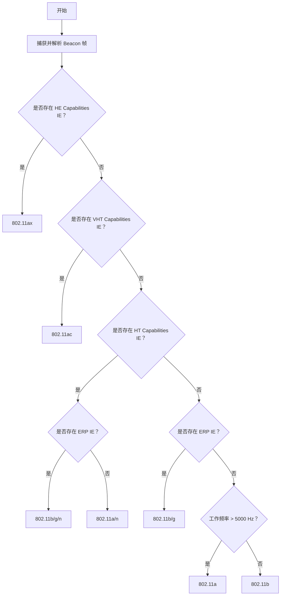

```mermaid
flowchart TD
    Start[开始] --> Parse[捕获并解析 Beacon 帧]
    Parse --> HECap{是否存在 HE Capabilities IE？}
    HECap -->|是| AX[802.11ax]
    HECap -->|否| VHTCap{是否存在 VHT Capabilities IE？}
    VHTCap -->|是| AC[802.11ac]
    VHTCap -->|否| HTCap{是否存在 HT Capabilities IE？}
    HTCap -->|是| ERP1{是否存在 ERP IE？}
    HTCap -->|否| ERP2{是否存在 ERP IE？}
    ERP1 -->|是| BGN[802.11b/g/n]
    ERP1 -->|否| AN[802.11a/n]
    ERP2 -->|是| BG[802.11b/g]
    ERP2 -->|否| Freq{工作频率 > 5000 Hz？}
    Freq -->|是| A[802.11a]
    Freq -->|否| B[802.11b]
```

