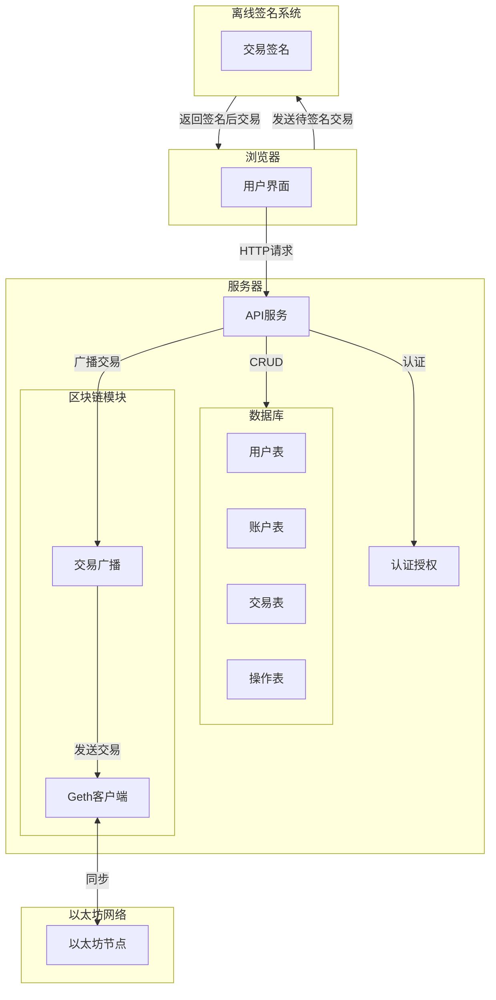

**系统需求与配置说明（优化版）**

**系统角色**	**硬件需求**	**网络要求**	**其他要求**

**在线系统**	- Linux 环境- 2 核 CPU- 2 GB 内存及以上- 30 GB SSD 及以上	- 需连接互联网	- 部署 Geth 客户端，连接以太坊区块链

**离线系统**	- Linux 环境- 2 核 CPU- 2 GB 内存及以上- 30 GB SSD 及以上	- 不联网	- **安全芯片**：支持 PC/SC 标准库驱动和 APDU 命令，至少 3 个- **U 盘**：用于与在线系统之间传递数据，至少 2 个

**客户端**	- Windows 或 Linux 系统- 至少 3 台设备	- 与服务器处于同一内网，不联网	- 可访问离线系统和 HSM，需运行相关软件

**HSM**	- 部署在离线系统服务器上	- 无需联网	- 用于客户端与离线系统建立安全通道

**安全芯片**	- 独立硬件设备- 支持 PC/SC 标准库驱动和 APDU 命令	- 不联网	- 至少 3 个，提供关键操作的硬件加密功能

**U 盘**	- 支持 USB 接口- 至少 16 GB 容量	- 无联网要求	- 至少 2 个，用作在线系统与离线系统之间的数据物理传递介质

**说明：**

​	1.	**安全芯片**：提供强大的硬件加密能力，执行离线系统中的关键加密/解密操作。

​	2.	**U 盘**：作为在线系统和离线系统之间的物理数据传递工具，保证隔离环境下的数据安全。

​	3.	**优化重点**：将 U 盘和安全芯片单独列出，更清晰地展示其功能与需求，便于实施部署时直接参考。

如果有其他细节需调整，请进一步说明！
